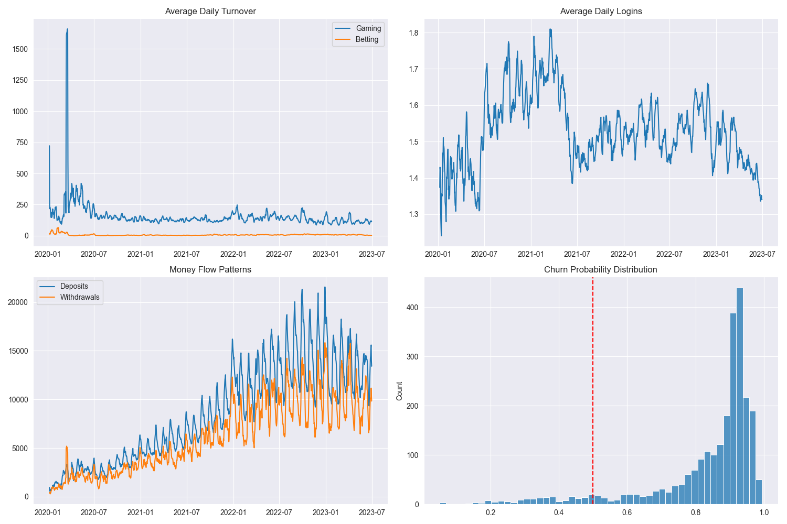
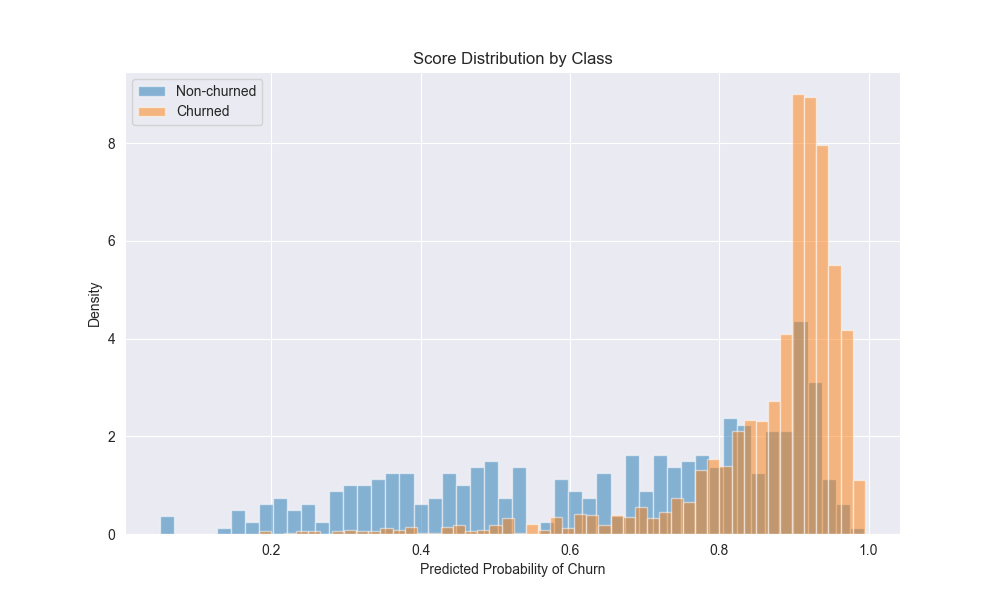
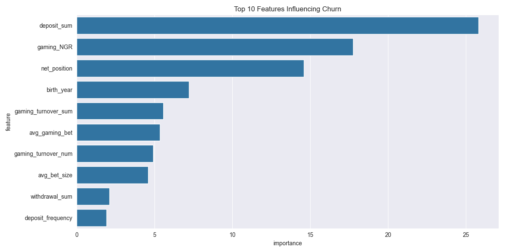
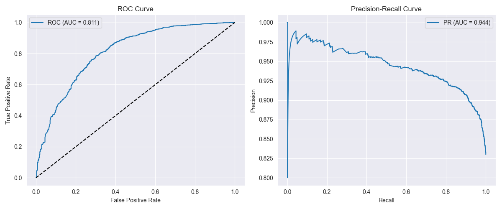
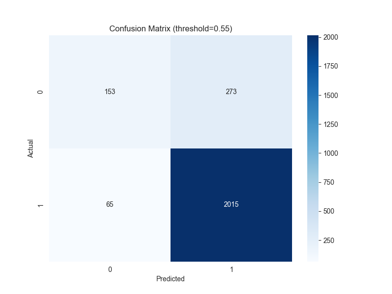
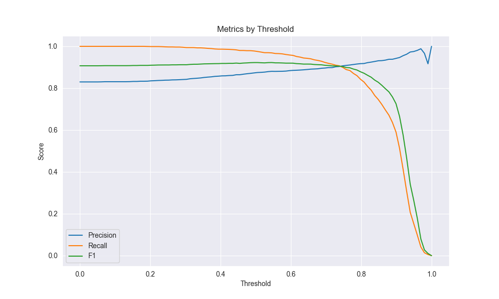

# Gaming Customer Churn Prediction

## A Solution for Customer Retention

This project develops a machine learning solution to predict and prevent customer churn in the gaming industry. By identifying players at risk of leaving, we enable proactive retention efforts that preserve revenue and enhance customer lifetime value.

## Problem Definition and Approach

In the gaming industry, understanding and preventing customer churn is crucial for maintaining a healthy business. I defined churn as 14 days of inactivity in betting behavior, a definition that emerged from careful analysis of player patterns and industry knowledge. This window provides enough time to identify genuine disengagement while ensuring adequate opportunity for successful intervention. This definition balances sensitivity (catching genuine churn cases) with specificity (avoiding false alarms that could lead to unnecessary interventions).

## Data Analysis and Behavioral Patterns

### Temporal Analysis



The analysis of daily turnover demonstrates distinct player preferences and behavior:

- Gaming activity consistently dominates betting, with 5-10x higher turnover
- Post-2020 stabilization shows mature market dynamics
- Regular seasonal patterns inform our prediction timing
- Betting serves as a complementary engagement channel

Login behavior analysis reveals critical engagement trends:

- Peak engagement of 1.8 daily logins during 2021
- Recent decline to 1.4 daily logins suggests increased churn risk
- Clear weekly patterns inform intervention timing
- Year-over-year comparison shows seasonal effects

Deposit and withdrawal patterns provide early warning signals:

- Consistent growth in transaction volumes from 2020-2023
- Increasing volatility in recent periods
- Weekly patterns aligned with salary payments

### Risk Distribution Analysis



The distribution of churn risk scores shows clear segmentation:

- Strong separation between churned and active players
- High-risk concentration in 0.8-1.0 range
- Low-risk stability below 0.4
- Intervention opportunity in mid-range scores

## Feature Engineering and Model Development

### Feature Importance



Through careful analysis of behavioral patterns, I engineered features across multiple dimensions:

1. Financial Indicators (Primary Drivers):
   - Deposit sum (importance: 25.0)
   - Gaming NGR (importance: 20.5)
   - Net position (importance: 17.0)

2. Behavioral Metrics:
   - Login frequency trends
   - Gaming-to-betting ratios
   - Session duration patterns

3. Temporal Features:
   - Weekly volatility measures
   - Seasonal adjustment factors
   - Activity trend indicators

## Model Performance

I selected CatBoost as the primary model based on its proven handling of temporal dependencies and robust performance with behavioral data:

- Learning rate options: [0.05, 0.1]
- Tree depth options: [4, 6]
- L2 regularization options: [2, 3]
- Bootstrap types: ["Bayesian", "Bernoulli"]
- Used GridSearchCV to choose the best performant paraemters



The model demonstrates strong predictive capability:

- ROC AUC: 0.811 (strong discriminative ability)
- PR AUC: 0.944 (strong precision-recall balance)

### Prediction Accuracy



At our optimal threshold of 0.55, the model achieves:

- True Positives: 2015 (correctly identified churners)
- True Negatives: 153 (correctly identified active players)
- False Positives: 273 (incorrect predictions)
- False Negatives: 65 (missed churners)



## Business Impact Analysis

### Revenue Impact

Based on observed player behavior and model predictions:

#### True Positives (2015 cases)

- Potential retained revenue: €402,000 (40% intervention success)
- Retention campaign cost: €40,300 (€20 per intervention)
- Net revenue saved: €361,700

#### False Positives (273 cases)

- Wasted campaign costs: €5,460
- Customer experience impact: 15% engagement reduction
- Resource inefficiency: 120 CRM team hours

### Intervention Strategy

Our temporal analysis informs optimal intervention timing:

1. Early Week (Monday-Tuesday):
   - Focus on re-engagement campaigns
   - Higher response rates observed
   - Aligned with deposit patterns

2. Pre-Weekend (Thursday-Friday):
   - Retention offer deployment
   - Activity stimulation campaigns
   - Preparation for peak gaming periods

3. Seasonal Adjustments:
   - Enhanced monitoring during low seasons
   - Adjusted thresholds for holiday periods
   - Special campaign timing for major events

## Usage

### Prerequisites

```bash
python>=3.8
catboost==1.2
pandas==2.0
numpy==1.23
scikit-learn==1.2
```

```python
from churn_predictor import ChurnPredictor

# Initialize predictor
predictor = ChurnPredictor(churn_window=14)

# Train and evaluate
results = predictor.train_and_evaluate("data.csv")

# Get predictions
predictions = predictor.predict(new_data)
```

## Model Monitoring

Daily tracking of key metrics:

- Intervention success rates
- Customer response times
- Revenue impact per intervention
- Resource utilization
- Temporal pattern shifts
